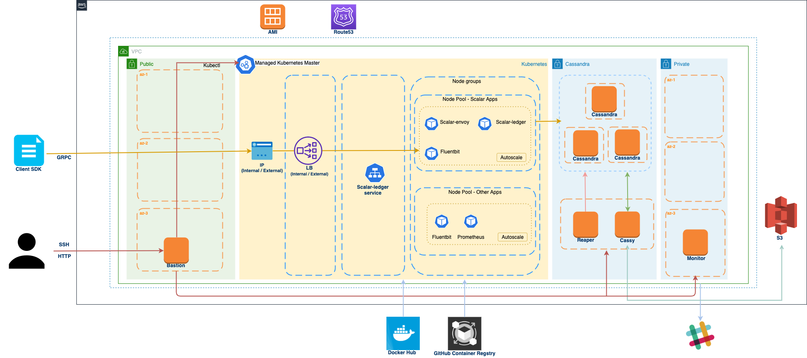

# How to create a Kubernetes cluster in Amazon EKS with scalar-terraform

This document shows how to create a Kubernetes cluster in Amazon Elastic Kubernetes Service (EKS) along with a VPC, a bastion host, and database resources using Terraform scripts.

## Prerequisites

* Terraform >= 0.12.x
* Ansible >= 2.9
* AWS CLI
* ssh-agent with private key
* An S3 bucket URI to store Cassandra backups with Cassy

You also need to have enough permissions to deploy the Kubernetes cluster with Terraform. Please see [Restricting Cloud Privileges for scalar-terraform](./CloudPrivileges.md#AWS) for more detail.

## Architecture



## What is created

* An AWS VPC with NAT gateway
* An EKS cluster with two Kubernetes node pools
* DNS Zone for internal host lookup
* With Cassandra option (default):
  * 3 Cassandra instances
  * 1 Cassy instance
  * 1 Reaper instance
* 1 Bastion instance with a public IP
* 1 Monitor instance to collect metrics and logs

## Clone scalar-teraform-examples

```console
$ git clone https://github.com/scalar-labs/scalar-terraform-examples -b <main or tag> /path/to/scalar-terraform-examples
$ export SCALAR_TERRAFORM_EXAMPLES=/path/to/scalar-terraform-examples
```

## Create network resources

```console
$ cd ${SCALAR_TERRAFORM_EXAMPLES}/aws/network

# Generate a test key-pair
$ ssh-keygen -b 2048 -t rsa -f ./example_key -q -N ""
$ chmod 400 example_key

# You need to add the key to your ssh agent
$ ssh-add example_key

# Create an environment and bastion server
$ terraform init

# Update the "name" to a unique value for your deployment inside "example.tfvars"
$ terraform apply -var-file example.tfvars
```

Note that the current version uses [the `network` module](../modules/aws/network). It uses the master branch, but it would probably need to be changed if you deploy it in your production environment.

### Create SSH config file

Once the `terraform apply` is finished, the network module can output the SSH config file.

```console
terraform output ssh_config > ssh.cfg
```

It is needed to connect to the various hosts created with scalar-terraform in the following steps.

## Create Kubernetes cluster

By default, `scalar-terraform` creates an EKS cluster with `public and private` endpoint accesses.

It is recommended to deploy without changing `public_cluster_enabled` and later deploy with `public_cluster_enabled = false` to make it not publically available for security reasons since some configurations like `cluster_auto_scaling` (false by default) requires the cluster to be public to work properly.

Please see [the sidenote](./EKSDeploymentSidenote.md) for more detail.

```console
$ cd ${SCALAR_TERRAFORM_EXAMPLES}/aws/kubernetes

# Create the Kubernetes cluster
$ terraform init
$ terraform apply -var-file example.tfvars
```

For more information about the variables in `example.tfvars`, please refer to [`kubernetes` module](../modules/aws/kubernetes).

## Create database resources

Deploy a Cassandra cluster.

### Cassandra

```console
$ cd ${SCALAR_TERRAFORM_EXAMPLES}/aws/cassandra

# Create the cassandra cluster
$ terraform init
$ terraform apply -var-file example.tfvars
```

Note that the current version uses [the `cassandra` module](../modules/aws/cassandra). It uses the master branch, but it would probably need to be changed if you deploy it in your production environment.

By default, Cassandra nodes don't start up after the deployment. Once you update the configuration of each node, you need to start up the Cassandra service manually.

```console
$ cd ${SCALAR_TERRAFORM_EXAMPLES}/aws/network
$ ssh -F ssh.cfg cassandra-1.internal.scalar-labs.com
[centos@cassandra-1 ~]$ sudo systemctl start cassandra
```

But you can set `start_on_initial_boot` to `"true"` in the example.tfvars file before applying the deployment to let the nodes start automatically.

```hcl
cassandra = {
  start_on_initial_boot = "true"
}
```

## Create Monitor resources

The Scalar deployment tools include a Prometheus metrics server, a Grafana data visualization server, an Alertmanager server for the Cassandra cluster, the Cassy instance, and the bastion server.

```console
$ cd ${SCALAR_TERRAFORM_EXAMPLES}/aws/monitor

# Create the monitor server for cassandra modules and log collection
$ terraform init
$ terraform apply -var-file example.tfvars
```

Note that the current version uses [the monitor module](../modules/aws/monitor). It uses the master branch, but it would probably need to be changed if you deploy it in your production environment.

## How to access scalar-terraform network

### Get SSH config from `terraform output`

You can get some useful information about your deployments, such as a bastion public, internal IP addresses, and an SSH config that you can use to access instances.

Save the SSH config to a file named `ssh.cfg` in the `network` module. The config assumes that the private key for an environment is added to your ssh-agent.

```console
cd ${SCALAR_TERRAFORM_EXAMPLES}/aws/network
terraform output ssh_config > ssh.cfg
```

### How to SSH to instances

You can log in to instances in the scalar-terraform network using the `ssh.cfg`.
Here are some examples:

```console
# You need to cd to the network module directory
$ cd ${SCALAR_TERRAFORM_EXAMPLES}/aws/network

# Connect to the instances
$ ssh -F ssh.cfg cassandra-1.internal.scalar-labs.com
$ ssh -F ssh.cfg cassandra-2.internal.scalar-labs.com
$ ssh -F ssh.cfg cassandra-3.internal.scalar-labs.com
$ ssh -F ssh.cfg cassy-1.internal.scalar-labs.com
$ ssh -F ssh.cfg reaper-1.internal.scalar-labs.com
$ ssh -F ssh.cfg monitor-1.internal.scalar-labs.com
```

## Next Steps

* Please follow [How to install Kubernetes CLI and Helm on the bastion](https://github.com/scalar-labs/scalar-kubernetes/tree/master/docs/PrepareBastionTool.md) to install required tools to deploy applications from the bastion host, then go to [How to deploy Scalar DL on Kubernetes with Ansible](https://github.com/scalar-labs/scalar-kubernetes/tree/master/docs/DeployScalarDLAnsible.md) to do the deployment.
* Alternatively, you can do the deployment process by running Helm charts directly from your local machine. Please refer to [Deploy Scalar DL with Helm](https://github.com/scalar-labs/scalar-kubernetes/tree/master/docs/DeployScalarDLHelm.md) for details.

### Monitoring and log collection

* Please refer to [Kubernetes Monitor Guide](https://github.com/scalar-labs/scalar-kubernetes/tree/master/docs/K8sMonitorGuide.md) for monitoring with Grafana, Alertmanager, and Prometheus.
* Please refer to [How to collect logs from Kubernetes applications](https://github.com/scalar-labs/scalar-kubernetes/tree/master/docs/K8sLogCollectionGuide.md) for collecting logs in the monitor server with Fluent Bit.
