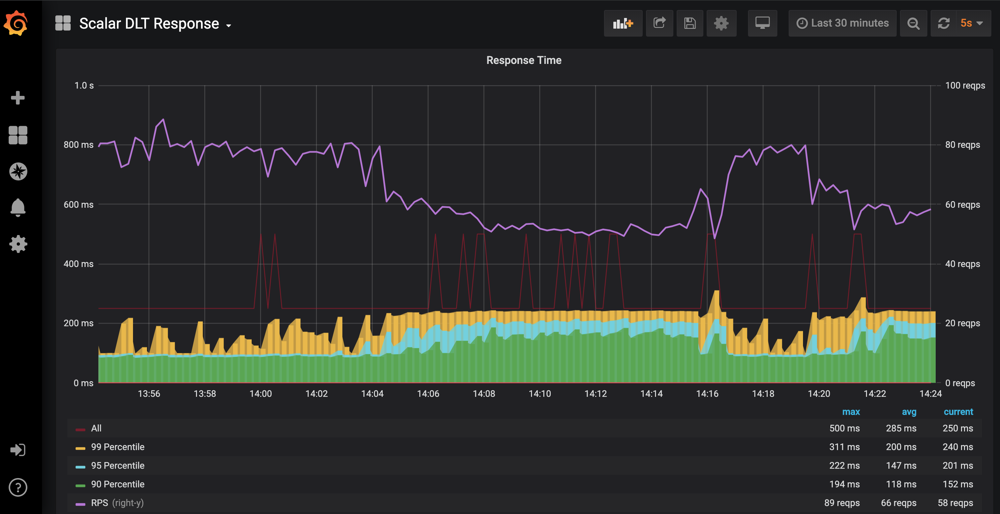

# Scalar Monitor Guide
The Scalar deployment tools include a Prometheus metrics server, Grafana data visulization server, and Alertmanager server.

Normally, accessing the Grafana server is enough to see the overall system status.

## How to access.
When you deploy a Scalar environment you need to provide a public/private key-pair. This key-pair will be used to tunnel a connection to the monitoring system.

It is assumed that the private key is loaded into an ssh-agent.

```console
ssh-add ~/.ssh/mykey.pem
```

To access the monitoring apps such as Grafana, you need to create an SSH tunnel to the bastion host.

```console
terraform output ssh_config > ssh.cfg
ssh -F ssh.cfg bastion
```

Then the folloing is the URL of the monitor index page.

* http://localhost:8000/

The following is a list of the individual app URLs.

* Grafana http://grafana.localhost.scalar-labs.com:8000/
* Prometheus http://prometheus.localhost.scalar-labs.com:8000/
* Alertmanager http://alertmanager.localhost.scalar-labs.com:8000/

**Note:**

1. The above hostnames (`*.localhost.scalar-labs.com`) simply all point to
   `127.0.0.1`. An Nginx proxy server running at the monitor host routes
   requests to those URLs by the hostnames.

2. You can use any port number you like for the forwarding local port by editing
   the following line in ssh.cfg.

    ```ssh config
    LocalForward 8000 monitor-1.internal.scalar-labs.com:80
    ```

3. You can also create a tunnel directly to the monitor host to access the apps.

    ```console
    ssh -F ssh.cfg -L 3000:localhost:3000 -L 9090:localhost:9090 monitor-1.internal.scalar-labs.com
    ```

    With the above command, http://localhost:3000/ will navigate to Grafana and
    http://localhost:9090/ to Prometheus.

### Grafana

#### Dashboards

Grafana has several provided dashboards that can be used to view the system status. One key dashboard is the `Scalar DLT Response` which shows the response times of Scalar DL.


